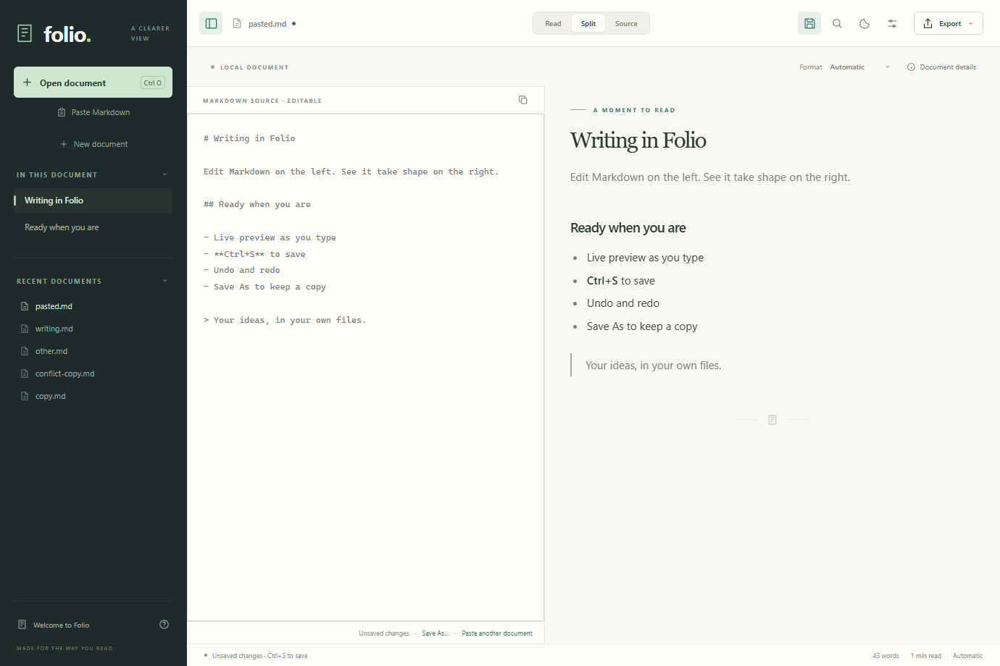

<p align="center"></p>
<h1 align="center">Folio</h1>
<p align="center"><strong>Markdown, clearly.</strong><br>A standalone Windows reader and editor for documents, diagrams, and the details in between.</p>
<p align="center">
<a href="https://github.com/GitKama/folio/releases"></a>
<a href="LICENSE"></a>

<a href="https://github.com/GitKama/folio/actions/workflows/ci.yml"></a>
</p>
<p align="center"><a href="#download">Download</a> · <a href="docs/getting-started.md">User guide</a> · <a href="COMPATIBILITY.md">Markdown support</a> · <a href="CONTRIBUTING.md">Contribute</a></p>



## Download

**Windows 10/11, x64.** No separate Node.js, Python, browser, or Pandoc installation is needed to run the app.

| Download | Use it for |
| --- | --- |
| [Portable executable](https://github.com/GitKama/folio/releases/download/v1.1.0/Folio-1.1.0-win-x64.exe) | Launch without installing |
| [Windows installer](https://github.com/GitKama/folio/releases/download/v1.1.0/Folio-1.1.0-Setup-x64.exe) | Per-user installation and shortcuts |
| [Source code](https://github.com/GitKama/folio/releases/tag/v1.1.0) | Inspect, build, or change Folio |

Builds are **unsigned**. Windows may show an unknown-publisher warning. Release pages include SHA-256 checksums, verification results, and license information. Close an older Folio process before launching a different version. Updates are manual; Folio does not run an updater or background service.

## A comfortable place for Markdown

- **Read, Split, and Source views** with an outline, search, recent files, light/dark themes, and adjustable reading text.
- **Five interpretations:** Automatic, CommonMark, GitHub, Extended Markdown, and Obsidian.
- **Rich documents:** tables, task lists, footnotes, front matter, callouts, wiki links, syntax highlighting, KaTeX math, Mermaid, and Graphviz.
- **Portable exports:** self-contained HTML and PDF, including supported images, math, and rendered diagrams.
- **Local by default:** no account, telemetry, or document upload. Remote images are opt-in. External web links open only when followed.

**New in 1.1:** edit in Split or Source with live preview, native undo/redo, Save and Save As. Unsaved-change prompts and external-file conflict handling protect ordinary editing workflows. There is no autosave or crash-recovery store.

[Version 1.0](https://github.com/GitKama/folio/releases/tag/v1.0.0) remains available as the original reader. See the [release history](CHANGELOG.md).

## Quick start

1. Open a Markdown file with **Ctrl+O**, drag and drop, or Paste Markdown.
2. Choose **Read**, **Split**, or **Source**. Try another Format if a dialect looks different.
3. Type in Split or Source; **Ctrl+S** saves and **Ctrl+Shift+S** saves a copy.
4. Search with **Ctrl+F**, navigate with the outline, or use Export for HTML/PDF.

Full instructions: [Getting started](docs/getting-started.md).

## What Folio deliberately does not do

Folio does not execute MDX components, notebook cells, document scripts, or site-generator templates. It does not reproduce every Markdown dialect, transclude an entire Obsidian vault, or convert HTML back to Markdown. Local document links and images stay inside the opened document's folder and descendants. [Compatibility details →](COMPATIBILITY.md)

## Build and test

Requires Windows x64, Git, and Node.js **22.22 or newer** (CI uses Node 22).

```powershell
git clone https://github.com/GitKama/folio.git
cd folio
npm ci
npm test
npm run build
npm start
```

`npm run test:desktop` exercises the real Electron application. `npm run package` builds portable and installer executables in `release/`. See the [developer guide](docs/development.md) and [architecture](docs/architecture.md).

## Contributing and support

Bug reports, small fixes, and representative Markdown fixtures are welcome. Read [CONTRIBUTING.md](CONTRIBUTING.md), open an [issue](https://github.com/GitKama/folio/issues/new/choose), or propose a pull request. Report vulnerabilities through the process in [SECURITY.md](SECURITY.md).

## License and acknowledgments

Folio's original application code is [MIT licensed](LICENSE). Bundled dependencies retain their own licenses: **the complete executable is not exclusively MIT software**. Graphviz is EPL-2.0; its corresponding source and build references are provided with releases. Electron/Chromium and other notices are shipped with the app. See [third-party licensing](docs/licensing.md), [THIRD_PARTY_NOTICES.txt](THIRD_PARTY_NOTICES.txt), and [licenses/](licenses/).

Built with Electron, Vite, Markdown-it, DOMPurify, KaTeX, Mermaid, Viz.js, and Graphviz. Thank you to their maintainers and contributors.
