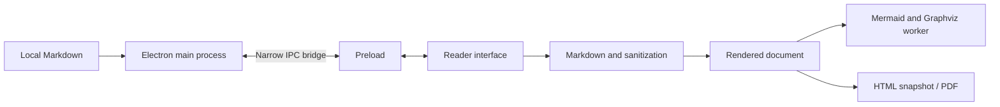

# Architecture

Folio is an Electron application with a Vite-built renderer. It operates on one document at a time and keeps interpretation separate from the input text.

| Area | Files |
| --- | --- |
| Window, IPC, dialogs, file watching, export | electron/main.cjs |
| Minimal native bridge | electron/preload.cjs |
| Files, encodings, contained paths | electron/files.cjs |
| Interface and document state | src/app.js |
| Markdown dialects and sanitization | src/engine.js |
| Diagrams | src/diagrams.js, src/graphviz.worker.js |
| Standalone export | src/export.js |

The renderer enables context isolation and sandboxing and disables Node integration. IPC checks the sender and main frame. HTML/SVG is sanitized; navigation and webviews are blocked. Asset capabilities restrict local images, with realpath checks for junctions. Remote images are opt-in.

PDF uses a restricted renderer. Diagrams have count/size limits; Graphviz runs in a worker with a timeout. These are practical, tested boundaries, not a formal security certification.
