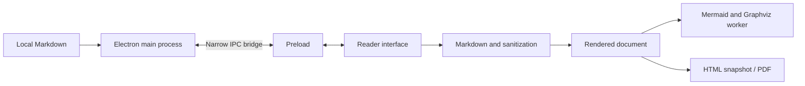

# Architecture

Folio is an Electron application with a Vite-built renderer. It operates on one document at a time and keeps interpretation separate from the input text.

| Area | Files |
| --- | --- |
| Window, IPC, dialogs, file watching, export | electron/main.cjs |
| Minimal native bridge | electron/preload.cjs |
| Files, encodings, contained paths | electron/files.cjs |
| Interface and document state | src/app.js |
| Markdown dialects and sanitization | src/engine.js |
| Diagrams | src/diagrams.js, src/graphviz.worker.js |
| Standalone export | src/export.js |

The renderer enables context isolation and sandboxing and disables Node integration. IPC checks the sender and main frame. HTML/SVG is sanitized; navigation and webviews are blocked. Asset capabilities restrict local images, with realpath checks for junctions. Remote images are opt-in.

PDF uses a restricted renderer. Diagrams have count/size limits; Graphviz runs in a worker with a timeout. These are practical, tested boundaries, not a formal security certification.

## Editing in 1.1

The renderer keeps text separate from its saved baseline. Preview rendering is debounced and does not reset the textarea, caret or native undo history. Pending previews are flushed before export.

The main process maintains the draft for native close/open protection. Saving uses a same-directory temporary file, flush, revision checks and rename. Changed disk revisions prompt a conflict decision. Watching reloads clean documents and preserves unsaved drafts. This is optimistic conflict detection, not collaborative file locking.

## PDF profiles in 1.2

`src/pdf-profiles.js` transforms an export clone; `src/pdf.css` provides print typography. The reader and Markdown text remain unchanged. Complex spanning/nested tables keep their grid. The selector persists local preferences independently of Markdown dialect settings.

`electron/pdf.cjs` supplies escaped running headers, page numbers and Chromium print options. A one-document `folio-print` protocol lives in a fresh in-memory session, avoiding data URL size limits. The print renderer remains sandboxed, with scripts, network access and local file access blocked. The protocol handler and window are removed after export.
