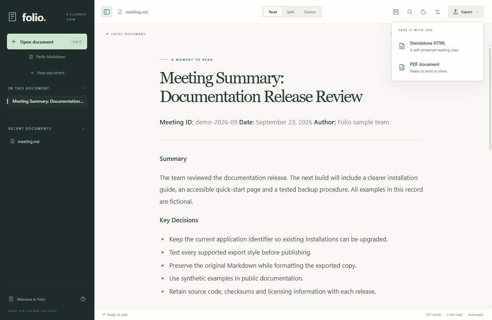
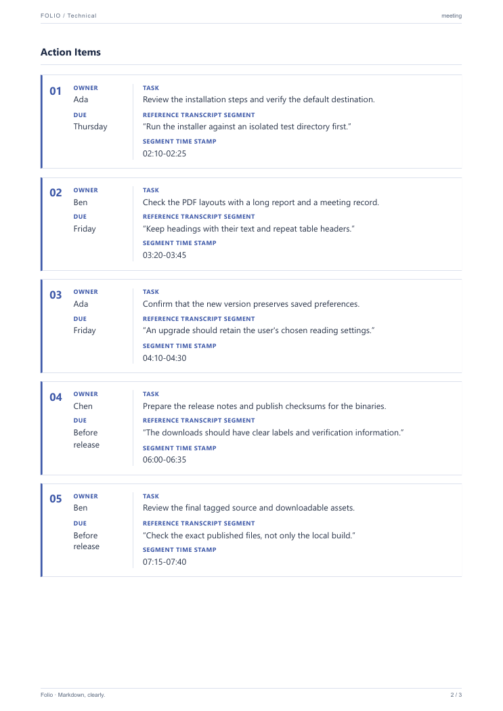

# PDF exports that suit the document

Choose **Export → PDF** or press **Ctrl+P**, select a profile and choose **Save PDF**. Technical is the initial choice. Folio remembers the last profile and layout switches on this computer.

| Profile | Best starting point | Type and color | Initial layout switches |
| --- | --- | --- | --- |
| **Technical** | Meeting notes, action registers, technical reviews | Segoe UI with blue accents | Wide-table cards and meeting layout on |
| **Studio** | Everyday reports, comparisons, compact documents | Segoe UI with teal accents | Original table grid; meeting layout off |
| **Editorial** | Essays, narrative reports, longer reading | Georgia with warm accents | Wide-table cards on; meeting layout off |

Switching profile loads its suggested switches. Adjust them before saving to fit the document. Typography uses system fonts and Chromium embeds the fonts it uses in the PDF; no additional font download is required.

## Two useful switches

**Readable cards for wide tables** turns each row of a simple table with four or more columns into a labeled card. Owner/Assignee and Due fields move to a narrow side column. Values, inline formatting and links stay in the export. Empty cells stay empty. Spanning cells, nested tables and multiple header rows retain their original table layout. Turn cards off for numeric comparisons where column alignment matters.

**Meeting section layout** promotes short, entirely bold paragraphs to headings. Top-level sections named Action Items, Discussion Highlights, Next Steps or Appendix start on a new page. These labels are currently English and matched without case sensitivity. Disable this switch for continuous prose or a more compact export.

## What the export includes

- A4 pages, running document name, page numbers and selectable text.
- Print-specific spacing, wrapping code and repeated table headers.
- Embedded supported images, math fonts and rendered diagrams.
- Chromium-generated PDF tags and heading outlines. This is not a claim of PDF/UA conformance.
- The latest unsaved edit, without saving or rewriting the Markdown.

PDF styling is independent of the reader's light/dark theme. Already-rendered diagrams keep their diagram theme with a matching background. Layout changes apply only to the exported copy. HTML exports retain their existing standalone reading layout.

## Try it

Open [the fictional meeting example](../samples/meeting.md) and export it in each profile. Technical gives the meeting a separate actions page; Studio keeps the table grid; Editorial uses serif body text. No private meeting material is included in the repository.

Unusually wide grids and very long cards may require turning the switches on or off. Oversized content can flow across pages. Missing or unembeddable images stop export with an explanation. Folio produces PDFs locally; it does not upload the document to a conversion service.
