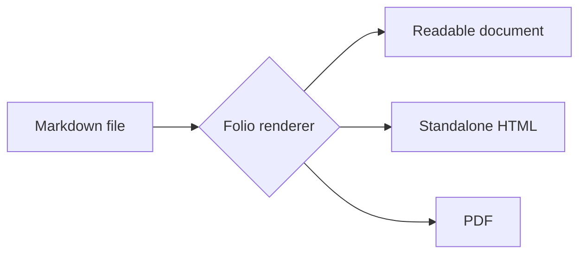
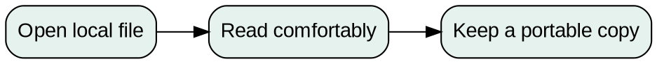

# Folio compatibility atlas

A deliberately varied document for checking that **ordinary Markdown stays readable**, while useful extensions work together. It is a fixture, not a claim of universal dialect compatibility.

## Core formatting

Paragraphs support *emphasis*, **strong emphasis**, ***both together***, ~~strikethrough~~, `inline_code()`, and escaped \*literal asterisks\*.

An automatic URL: https://example.com. An explicit [reference destination][reference]. An inline [safe external link](https://example.com/guide "A link title").

> A block quotation with **formatting**.
>
> > A nested quotation.

1. First ordered item.
2. Second ordered item.
   - A nested unordered item.
   - Another nested item.

- [x] Completed task
- [ ] Pending task
- [ ] A task containing **rich text**

Setext subsection
-----------------

Line one with a hard break.  
Line two.

---

## Tables and notes

| Feature | State | Detail |
| :--- | :---: | ---: |
| GFM tables | Ready | 3 |
| Escaped pipe | `a\|b` | 2 |
| Unicode | Καλημέρα • 日本語 • مرحبا | 1 |

A sentence with a footnote.[^proof] Reusing the same footnote.[^proof]

Markdown
: A text format with many overlapping dialects.

Viewer
: An application for reading rendered documents.

The HTML specification uses HTML. CSS controls presentation.

*[HTML]: HyperText Markup Language
*[CSS]: Cascading Style Sheets

## Mathematics

Inline math: $E = mc^2$ and $\alpha + \beta = \gamma$.

$$
\int_0^1 x^2 \, dx = \frac{1}{3}
$$

## Syntax-highlighted code

```javascript
const greet = (name) => `Hello, ${name}!`;
console.log(greet("Folio"));
```

```python
def square(value: float) -> float:
    return value ** 2
```

````markdown
```nested-fence
This is text inside a longer code fence.
```
````

    Indented code stays literal: <script>not executable</script>

## Mermaid diagram



## Graphviz diagram



## Notes and callouts

> [!NOTE]
> An Obsidian and GitHub style note with **formatted content**.

> [!WARNING] Readability has boundaries
> Executable components are not ordinary Markdown.

::: tip A useful hint
Prefer a dialect profile when a document comes from a specific app.
:::

!!! note "Python-Markdown style note"
    This body uses the indentation-based admonition convention.

## Local documents and images

A wiki link to [[Linked Note]], an aliased link [[Linked Note|the companion note]], and a regular [relative document link](Linked%20Note.md).

![[Linked Note#Embedded section]]


![[assets/local-diagram.svg|320]]


## Safe HTML

<details>
<summary>A collapsible HTML detail</summary>
<p>This uses ordinary <strong>safe inline HTML</strong>.</p>
</details>

<kbd>Ctrl</kbd> + <kbd>O</kbd> opens a document.

## Sanitization fixture

The following intentionally hostile HTML must remain inert. No visible dialog, new window, or script execution should occur.

<script>window.__folioXss = "script"</script>

<a href="javascript:window.__folioXss='javascript-url'">Unsafe URL fixture</a>
<iframe srcdoc="<script>parent.__folioXss='iframe'</script>"></iframe>
<svg width="1" height="1" onload="window.__folioXss='svg-load'"><script>window.__folioXss='svg-script'</script></svg>

## Unsupported formats stay legible

The separate [unsupported dialect fixture](unsupported-dialects.md) contains MDX and site-generator directives. A viewer must never pretend to execute their original application runtimes.

## Duplicate heading

First duplicate.

## Duplicate heading

Second duplicate. The outline should still target this distinct heading.

## Unicode and long content

Emoji: 🌿 📚 🧪. CJK: 日本語 中文. Accents: café, naïve, español. Right-to-left text: مرحباً بالعالم.

`A_very_long_unbroken_inline_code_token_0123456789012345678901234567890123456789012345678901234567890123456789`

[^proof]: This footnote includes **strong text** and a [link](https://example.com).

[reference]: https://example.com/reference "Reference link"
