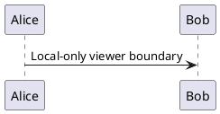

# Unsupported dialect boundary checks

This document intentionally includes extensions that belong to other runtimes. A local viewer can preserve or explain these constructs, but cannot reproduce their original behavior without those runtimes.

## MDX components

import InteractiveChart from './InteractiveChart.jsx'

<InteractiveChart source="private-dataset.csv" />

export const description = 'This code must not execute';

{(() => { window.__folioMdxExecuted = true; return 'Executed'; })()}

## Quarto executable cell

```{python}
#| label: fig-example
#| fig-cap: "A runtime-specific result"
print("This code must stay literal")
```

## Quarto and Pandoc directives

::: {.callout-note}
An attributed container belonging to another Markdown dialect.
:::

See @fig-example and [a citation, p. 5][@nonexistent2026].

## MkDocs directives

::: package.module.Object
    options:
      show_source: true

=== "Python"

    ```python
    print("Tab one")
    ```

=== "JavaScript"

    ```javascript
    console.log("Tab two");
    ```

## External rendering services



```d2
source -> destination: Literal fallback unless supported
```

## Malformed but readable

An unclosed $math expression and an unmatched **emphasis marker.

```mermaid
this is deliberately invalid mermaid text
```

```dot
digraph {
```
